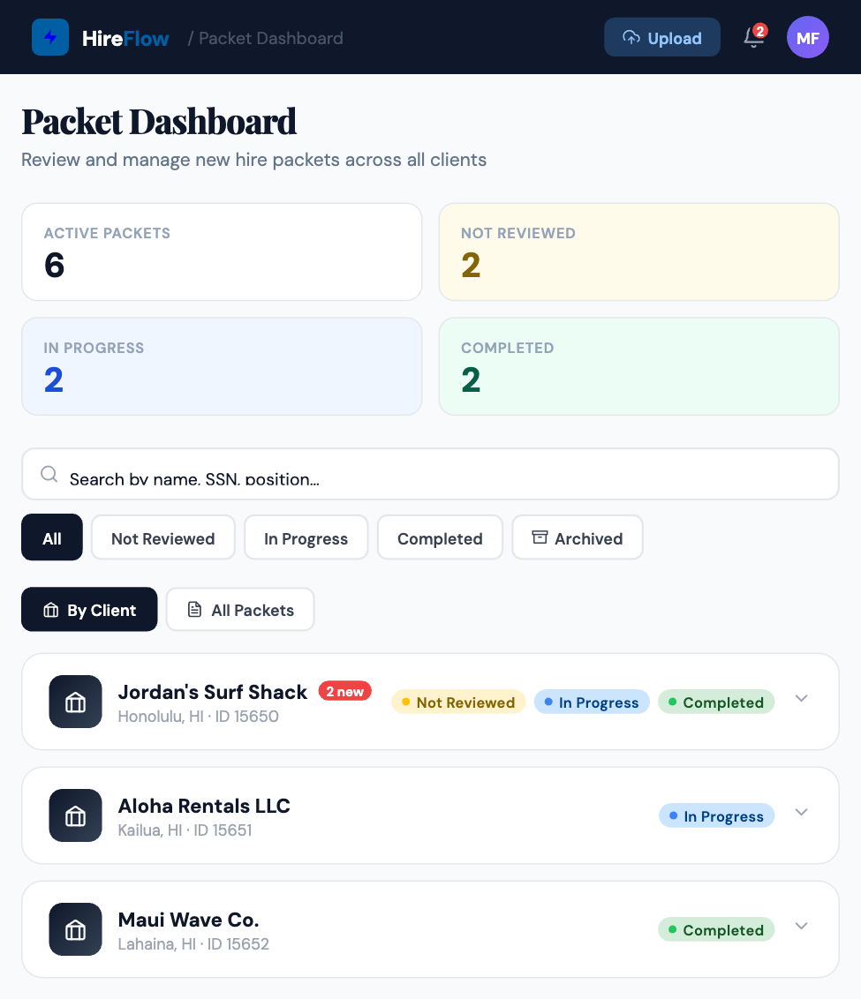
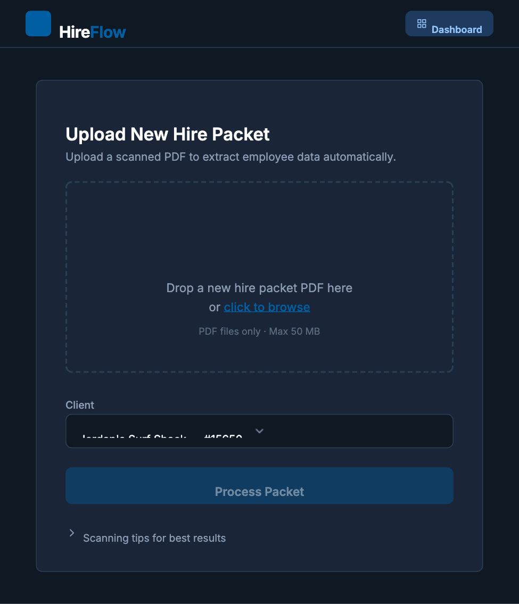

# HireFlow

**ProService New Hire Packet Automation Prototype**
Built by Devan Capps

HireFlow uses AI-powered document processing to automate the extraction and validation of handwritten new hire packet data for ProService Hawaii. Upload a scanned PDF, and HireFlow will extract employee information using Claude Vision AI, validate it against client-specific PrismHR codes, and generate the API payload ready for submission.

---

## Screenshots

### Packet Dashboard


### Upload New Hire Packet


---

## Quick Start (Mac)

If you just want to get it running, here are the steps:

```bash
# 1. Install poppler (required for PDF processing)
brew install poppler

# 2. Unzip and enter the project folder
cd hireflow

# 3. Create a virtual environment and activate it
python3 -m venv venv
source venv/bin/activate

# 4. Install Python dependencies
pip install -r requirements.txt

# 5. Run the app
python app.py

# 6. Open in your browser
# http://localhost:5001
```

The `.env` file is pre-configured with the Anthropic API key, so no additional configuration is needed.

### Try It Out

Two sample new hire packets are included in the `sample-packets/` folder:

| File | Pages | Notes |
|------|-------|-------|
| `New Hire Packet - Taylor Swift.pdf` | 12 pages | Complete packet with direct deposit |
| `New Hire Packet - LeBron James.pdf` | 8 pages | Shorter packet, no direct deposit |

1. Open [http://localhost:5001](http://localhost:5001)
2. Drag one of the sample PDFs from `sample-packets/` onto the upload area
3. Click **Process Packet** and wait ~30-60 seconds for AI extraction
4. Review the extracted data, scan quality, and validation results
5. Try **Generate Email** to see the missing-info email draft
6. Try **Submit to PrismHR** to see the mock API payload

---

## Features

- **AI-Powered Extraction** — Claude Vision reads handwritten forms and extracts employee data
- **Scan Quality Scoring** — Automatic quality analysis of each scanned page (sharpness, lighting, skew, coverage)
- **Packet Completeness Check** — Verifies expected page count against typical packet length
- **Code Validation** — Maps extracted values (job titles, locations, employee types) to valid PrismHR client codes with fuzzy matching
- **Confidence Scoring** — Per-field confidence percentages with visual cues for low-confidence fields
- **Side-by-Side Review** — View the original PDF alongside extracted/validated data with inline editing
- **Missing Info Email** — Auto-generates email drafts requesting missing information from the client
- **Mock PrismHR Submission** — Generates the `importEmployees` API payload matching PrismHR schema

## Prerequisites

- **Python 3.9+**
- **poppler** (required by `pdf2image` to convert PDF pages to images)
  - **Mac:** `brew install poppler`
  - **Linux:** `sudo apt-get install poppler-utils`
  - **Windows:** Download from [poppler releases](https://github.com/oschwartz10612/poppler-windows/releases) and add to PATH

## Setup (Detailed)

1. **Unzip the project and enter the folder:**

   ```bash
   unzip hireflow.zip
   cd hireflow
   ```

2. **Create a virtual environment:**

   ```bash
   python3 -m venv venv
   source venv/bin/activate  # Mac/Linux
   # or: venv\Scripts\activate  # Windows
   ```

3. **Install dependencies:**

   ```bash
   pip install -r requirements.txt
   ```

4. **Environment configuration:**

   The `.env` file is included and pre-configured with the Anthropic API key. No changes needed.

   If you need to reconfigure, copy `.env.example` to `.env` and add your key:

   ```bash
   cp .env.example .env
   ```

5. **Run the app:**

   ```bash
   python app.py
   ```

6. **Open in browser:**

   Navigate to [http://localhost:5001](http://localhost:5001)

## Sample Packets

Two test PDFs are included in the `sample-packets/` folder. Both are for employees being hired at Jordan's Surf Shack (client ID: 15650).

- **`New Hire Packet - Taylor Swift.pdf`** — 12 pages, complete packet including direct deposit form
- **`New Hire Packet - LeBron James.pdf`** — 8 pages, shorter packet without direct deposit

Processing takes approximately 30-60 seconds per packet due to the Claude Vision API calls.

## Tech Stack

| Layer | Technology |
|-------|-----------|
| Backend | Python 3.9+, Flask |
| AI / OCR | Anthropic Claude API (Claude Sonnet, Vision) |
| PDF Rendering | PDF.js (Mozilla, CDN) |
| Frontend | HTML5, CSS3, Vanilla JS |
| PDF Processing | pdf2image + Pillow |
| Client Codes | `data/client_codes.json` |

## Project Structure

```
hireflow/
├── app.py                    # Flask app — routes, PDF processing, Claude API calls
├── validator.py              # Validation engine — code mapping, field inference
├── requirements.txt          # Python dependencies
├── .env                      # API key (pre-configured)
├── .env.example              # Template for .env
├── README.md
├── sample-packets/           # Test PDFs to upload
│   ├── New Hire Packet - Taylor Swift.pdf
│   └── New Hire Packet - LeBron James.pdf
├── data/
│   └── client_codes.json     # Jordan's Surf Shack valid PrismHR codes
├── uploads/                  # Temp storage for processed PDFs (auto-created)
├── static/
│   ├── css/
│   │   └── styles.css        # Main stylesheet
│   └── js/
│       ├── app.js            # Upload page logic + utilities
│       └── pdf-viewer.js     # PDF.js viewer controls
├── screenshots/
│   ├── dashboard.png         # Packet dashboard screenshot
│   └── upload.png            # Upload screen screenshot
└── templates/
    ├── dashboard.html        # Packet dashboard (home screen)
    ├── index.html            # Upload screen (/upload)
    └── review.html           # Review + validation screen
```

## Author

Devan Capps
